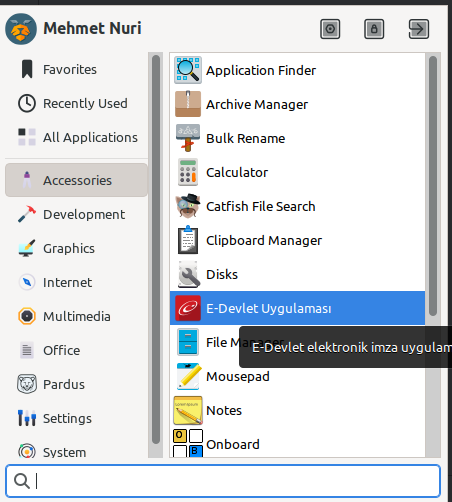
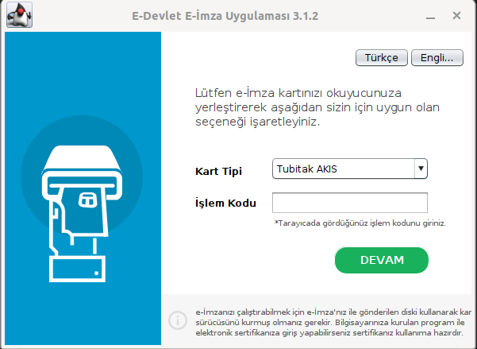

# E-Devlet  E-İmza 

[E-Devlet](https://www.turkiye.gov.tr) uygulaması e-imza ile giriş için jnlp dosyalarını kullanıyor. Ancak bazı durumlarda bu jnlp dosyası sistemde 
sorunlar yol açmakta ve çalışmamaktadır. Bu repoda e-devletin giriş için kullanmış olduğu jar dosyası paket haline
getirilmiş ve kaynak kodlarının tamamı açık halde sunulmuştur. 

27.05.2023 tarihinde oluşturulan bi repoda en son sürüm çekilmiştir. Eğer sürüm ile ilgili bir sorun ile karşılaşırsanız
paket içeriğindeki app.jar dosyasını [JAR](https://static.turkiye.gov.tr/downloads/e-imza/elektronik-imza.jar) linkinden 
e-devlet üzerinden indirip değiştirebilirsiniz.

Uygulama [Pardus 23 ](https://www.pardus.org.tr/) sürümünde paketlenmiş ve test edilmiştir.

## Önemli Notlar
- E-İmza sürücülerinizin sistem yüklendiğinden emin olun.
- Pardus yazılım merkezinden Akis in yüklendiğinden emin olun. 

## Ekran Görüntüleri

